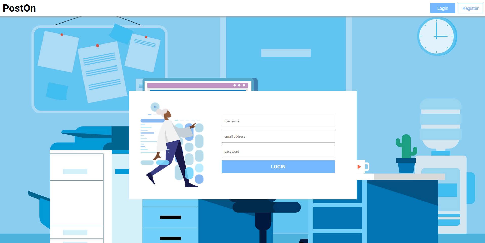
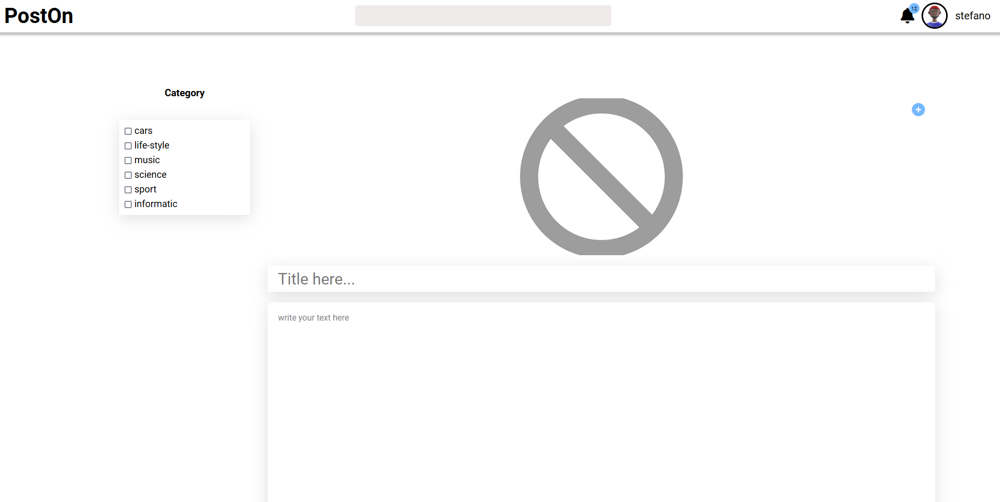

# poston-app
a social media application with react and spring boot

# POST ON 
## Documentation

### Start the app

- First start the Spring boot Api 


- Afterwards start the react App

```js
npm install  // install the dependencies and node_modules
````

```js
npm start  // start the react app
````


### Screens of the App








 
